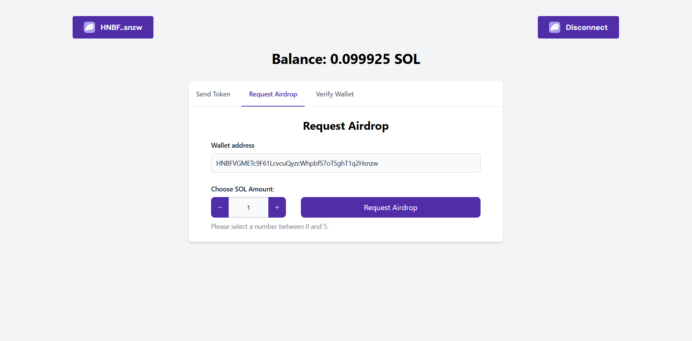

# Solana Wallet Integration DApp

This project is a React-based application for interacting with the Solana blockchain. It allows users to connect their Solana wallet, request airdrops, check balances, verify wallet signatures, and send tokens.



## Features

- **Connect and Disconnect Wallet**: Supports wallet connection with `@solana/wallet-adapter-react`.
- **Check Balance**: Displays the user's current SOL balance with real-time updates.
- **Request Airdrop**: Request up to 5 SOL on the Devnet to test transactions.
- **Send Tokens**: Transfer SOL to another wallet address.
- **Verify Wallet**: Sign a message with the wallet and verify its validity.

---

## Prerequisites

Before you begin, ensure you have met the following requirements:

- [Node.js](https://nodejs.org/) installed on your system.
- Familiarity with Solana Devnet and Solana CLI tools.
- Have installed a Solana Wallet in your browser.

---

## Installation

1. Clone the repository:
   ```bash
   git clone https://github.com/your-username/solana-wallet-app.git
   cd solana-wallet-app
   ```

2. Install dependencies:
   ```bash
   yarn install
   ```

3. Start the development server:
   ```bash
   yarn dev
   ```

4. Open the application in your browser: http://localhost:3000

## Technologies Used

- **React**: UI framework
- **Solana Web3.js**: Solana blockchain interaction
- **@solana/wallet-adapter**: Wallet connection management
- **Tailwind CSS**: Styling

## License
This project is open-source and available under the MIT License.

